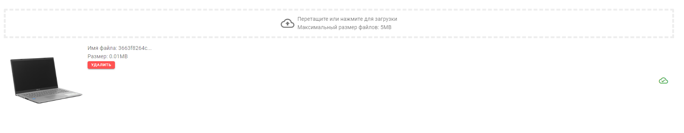

# drop-zone-file-uploader (RU)
Визуальный компонент drag-and-drop загрузки изображений для Vue 2 и Vuetify

<h3>Events</h3>
<b>input</b> - при добавлении файла, внутри компонента формируется массив (всегда) 
c добавленными файлами типа [File](https://learn.javascript.ru/file). С помощью события, данный массив синхронизируется с внешней переменной, для того, чтобы разработчик сам реализовал логику отправки файлов на сервер и их загрузки.
<h3>Props</h3>
<b>multiple</b> - Режим загрузки нескольких файлов


````
npm i drop-zone-file-uploader
````

````
<DropZone @input="inputFiles" multiple></DropZone>
````

````
import DropZone from "drop-zone-file-uploader"

export default {
...
  components: {
    DropZone
  },
...
````
# drop-zone-file-uploader (EN)
Drag-and-drop image loading visual component for Vue 2 and Vuetify

<h3>Events</h3>
<b>input</b> — when adding a file, inside the composition component (always)
with added files like [File](https://learn.javascript.ru/file). With the help of events, this array is synchronized with the appearance, so that the developer himself implements the logical logic of files on the server and their download.
<h3>Props</h3>
<b>multiple</b> - Multi-file upload mode


````
npm i drop-zone-file-uploader
````

````
<DropZone @input="inputFiles" multiple></DropZone>
````

````
import DropZone from "drop-zone-file-uploader"

export default {
...
  components: {
    Drop zone
  },
...
````

# Screenshot
